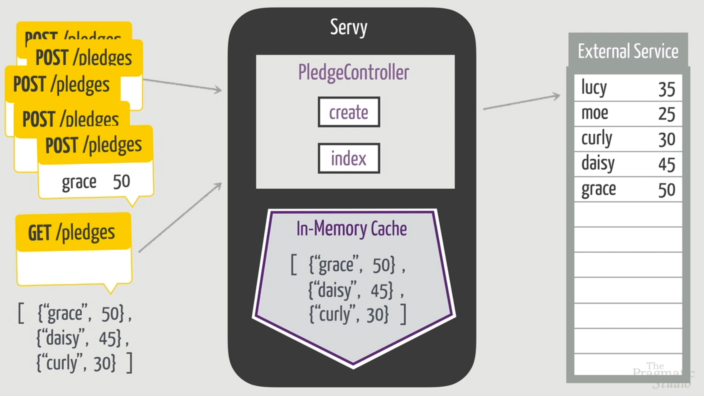

### Problem statement:

- A name and an amount will be sent to the server as a post request.
- Our server will forward the pledge data to an external API which will save it somewhere (we can just simulate it
  using `:timer.sleep`).
- However, we need to implement a GET pledges in our server which should send back the **last three** pledges that were
  created.
    - The last three pledges need to be stored in an **in memory cache** in the process.

- For the low level process based implementation of this, check [pledge_server.ex](pledge_server.ex).
- Refactored version of the same that makes it more generic and similar to GenServer,
  check [pledge_server_refactored.ex](pledge_server_refactored.ex).
- Finally, check [pledge_server_using_genserve.ex](pledge_server_using_genserve.ex) for implementing this with
  GenServer.